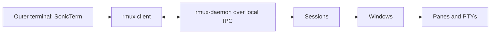

# RMUX

English | [简体中文](RMUX-zh-CN.md)

This repository uses RMUX 0.10.x as its terminal multiplexer. The tracked source is `config/rmux/rmux.conf`; `install.sh` links it to `~/.rmux.conf` and installs the Homebrew `rmux` formula on new Macs.

## What RMUX is

RMUX is an independent Rust multiplexer with a client/daemon architecture. The daemon owns shells, PTYs, sessions, windows, panes, scrollback, options, and process lifetime. A client attaches over local IPC and can detach without terminating those processes.



RMUX is not:

- a terminal emulator — an outer terminal still renders text, fonts, tabs, and native windows;
- a wrapper around a running tmux server — it has its own daemon and socket namespace;
- a byte-for-byte tmux clone — it implements a broad tmux command/config contract with documented differences.

One daemon normally serves each socket. `-L name` selects an isolated named socket, and `-S path` selects an explicit socket path. The default lifecycle keeps sessions alive when clients detach, but it is not disk persistence across daemon termination or reboot.

## Configuration discovery

On macOS and Linux, RMUX 0.10.0 checks these native locations:

```text
/etc/rmux.conf
~/.rmux.conf
$XDG_CONFIG_HOME/rmux/rmux.conf
~/.config/rmux/rmux.conf
```

If no native file loads, RMUX can fall back to standard tmux config locations. That fallback is intentionally avoided here: the archived tmux config contains executable TPM bootstrap commands. A native `~/.rmux.conf` makes startup deterministic. For diagnostics, `RMUX_DISABLE_TMUX_FALLBACK=1` also disables fallback.

RMUX config is tmux command syntax, not JSON, YAML, or TOML. It can execute `run-shell`, conditionals, and sourced files, so treat it as executable code.

## Repository profile

The profile is adapted from RMUX's v0.10.0 human-friendly example and selected compatible behavior from the retired tmux config.

| Setting | Repository value |
|---|---|
| Prefix | `C-q`; `prefix + C-q` sends a literal `C-q` |
| Reload | `prefix + r` |
| Mouse | On; `prefix + T` toggles native terminal selection |
| History | 100000 lines |
| Window/pane indices | Start at 1; windows renumber after close |
| Copy mode | Vi keys; `pbcopy` plus OSC 52 |
| Status | One bottom row, styled by the pinned Apollo RMUX release |
| Titles | Automatic rename off; `#S · #W` propagated outward |
| Terminal identity | `TERM=tmux-256color`; `TERM_PROGRAM=rmux` is preserved |
| Working directory | Active pane OSC 7 reports are relayed to SonicTerm |

The config clears stale `TERMINFO`, `TERMINFO_DIRS`, and `TERMCAP` inherited by a long-lived daemon, then sets `COLORTERM=truecolor` and `FORCE_COLOR=3`. It does not clear RMUX's own `TERM_PROGRAM` identity.

`install.sh` verifies the official `rmux-apollo-theme` release and links its theme-only config under `~/.config/rmux-apollo-theme/`. The local RMUX file sources it for status, window, pane, message, and copy-mode styles. The bar matches the local bufferline.nvim setup: slope separators, a dark-blue active tab with bold white text, and inactive tabs on the bar background. Only the active-tab colors are a fixed bufferline-specific override; all other colors come from Apollo. No plugin manager or shell bootstrap is added.

The bottom bar shows a red, slanted session label and slanted, numbered window tabs on the left, with a plain `HH:MM` clock on the right. A one-cell gap separates the label and tabs. Session names are capped at 19 display cells so both sloped ends fit within the 24-cell label budget. Activity and bell colors remain visible. `PREFIX` appears while the prefix is active; `ZOOM` marks a zoomed window. Sloped ends use the same Powerline glyphs as bufferline's `slope` style (`U+E0BA` and `U+E0BC`), so the terminal font or its fallback must support them. The bar has no full date or decorative clock icon.

The outer `xterm-256color` capability includes `osc7`, and `set-titles` is enabled. Oh My Zsh's `omz_termsupport_cwd` hook emits a host-qualified OSC 7 report at each prompt. RMUX records that report per pane and relays the active pane's path to SonicTerm, so relative file paths resolve against the correct directory. `#{pane_current_path}` is process metadata and does not replace the shell report. After changing `terminal-features`, reload the config and detach/reattach so the client capabilities are resolved again.

## Session helpers and resume

New SonicTerm tabs open normal shells. The late-loading `zz-rmux.zsh` file provides explicit helpers:

```sh
rr main       # create or resume main
rl            # list all sessions
rd main       # delete main
rs            # save all sessions, confirm, restart, restore
rh            # helper help, parent PID, and upgrade steps
```

`rr <name>` attaches to an exact session name or creates it when absent. A new server starts through a short-lived detached bootstrap; `rr` verifies the daemon's **parent PID is 1** before attaching. The terminal still owns the attached client, not the daemon. Existing servers are reused without restarting or forcibly reparenting them. `rd <name>` permanently ends that session. SonicTerm advertises its real `TERM_PROGRAM=SonicTerm`; only Copilot child processes receive the WezTerm compatibility identity.

Inside RMUX, the zsh helpers turn `exit`, `logout`, and Ctrl+D at an empty prompt into `detach-client`. Ctrl+D with text in the edit buffer keeps its normal delete/list behavior. `prefix + d` and closing the SonicTerm tab also disconnect the client while leaving panes running. Run `rr main` later to reconnect.

Use `rd <name>` for intentional session deletion. Closing SonicTerm does not require `rs`: detached sessions remain in the running daemon. PID 1 is the expected parent for newly bootstrapped servers, not a guarantee against crashes or system shutdown.

### Upgrade and restart

```sh
brew upgrade rmux
rs
```

Upgrade the package whenever needed; run `rs` only when ready to stop running programs. The current Homebrew formula has no service or restart hook. The installer retains matching client/daemon binaries outside Homebrew cleanup. Managed zsh helpers and the `rmux` shell function keep using the active pair until restart. Absolute Homebrew executable paths and explicit separate sockets bypass that protection.

`rs` has no parameters. It saves **all sessions, including detached sessions**, validates the snapshot, and asks for confirmation. Only then does an independent worker restart with the installed version and restore the workspace. A failed save or cancellation leaves the daemon alone. The worker is separate from the invoking pane, so restarting that pane cannot interrupt restoration.

Restore recreates session/window names, pane layouts, working directories, and active selections as fresh shells. It does not recover running programs, unsaved buffers, scrollback, or process memory, and never replays captured commands. Snapshot and runtime files stay private under `~/.local/state/rmux-store/` and `~/.local/share/rmux-store/`; do not commit them. Failures retain the snapshot instead of overwriting it with partial state.

There is no LaunchAgent, periodic save, or automatic reboot restoration. A crash or reboot can lose changes since the last `rs` save. `rh` shows only helper usage, the parent-PID behavior, upgrade steps, and restart warnings.

### Keybindings

The [complete RMUX keymap](RMUX-Keymap.md) lists all 278 effective bindings across the prefix, active Vi copy-mode, retained Emacs copy-mode, and root mouse tables.

| Action | Binding |
|---|---|
| Reload config | `prefix + r` |
| Rename current window (tab) | `prefix + n` |
| Toggle mouse/native selection | `prefix + T` |
| New window in current directory | `prefix + c` |
| Split right in current directory | `prefix + \|` |
| Split down in current directory | `prefix + -` |
| Focus pane | `prefix + h/j/k/l` |
| Resize pane, repeatable | `prefix + H/J/K/L` |
| Previous / next window (tab), repeatable | `prefix + Left/Right` |
| Last window | `prefix + Tab` |
| Copy mode | `prefix + v` |
| Start/select line/rectangle | `v` / `V` / `C-v` in copy mode |
| Copy and exit | `y` or `C-c` in copy mode |
| Zoom pane | `prefix + z` (RMUX default) |
| Detach | `prefix + d` (RMUX default) |

The `|`, `-`, and `c` commands use `#{pane_current_path}`, so new panes and windows inherit the active working directory.

## SonicTerm mouse integration

SonicTerm's Copilot guide requires RMUX's conditional root mouse bindings. The tracked config pins them instead of relying on RMUX defaults:

```tmux
set -g mouse on
bind -n MouseDown1Status select-window -t =
bind -n MouseDown1Pane { select-pane -t=; send -M }
bind -n MouseDrag1Pane { if -F '#{||:#{pane_in_mode},#{mouse_any_flag}}' { send -M } { copy-mode -M } }
bind -T copy-mode-vi MouseDragEnd1Pane send-keys -X copy-pipe-no-clear
set -s set-clipboard on
```

`MouseDown1Pane` selects the pane and forwards the press. `MouseDrag1Pane` forwards input when RMUX is already in a pane mode or the nested application requested mouse input; otherwise RMUX starts copy mode. Releasing the mouse copies RMUX-owned selections without clearing the highlight or leaving copy mode; press `q` to leave copy mode. This lets Copilot own transcript selection and edge scrolling. Do not force every drag into RMUX copy mode. Shift-drag remains the SonicTerm-local selection fallback.

Left-clicking a window tab uses `select-window -t =`. RMUX 0.10.0's default `switch-client -t =` can re-interpret internal pane `0` against `pane-base-index 1`, causing errors such as `invalid target 'leetcode:2.0'`. Selecting the window directly avoids that bug without changing pane numbering or tab styles.

## Clipboard trust

The profile uses both `copy-command 'pbcopy'` and `set-clipboard on`:

- copy-mode sends selected UTF-8 text to the macOS clipboard through `pbcopy`;
- OSC 52 allows trusted programs inside a pane, including nested SSH applications, to update the outer terminal clipboard.

`set-clipboard on` is a deliberate trust choice: pane output can replace the host clipboard. Use RMUX's safer `external` mode instead if panes may run untrusted programs.

## Claude Code teammate mode

Use normal `claude` or the repository's `cc` helper for an ordinary Claude Code session. Use RMUX explicitly when Claude Code should launch agent-team panes:

```sh
rmux claude --permission-mode bypassPermissions \
  --model 'claude-sonnet-5[1m]' --effort high
```

`rmux claude` enables Claude Code's tmux teammate mode and prepends a private, process-scoped `tmux` shim so Claude's teammate commands target RMUX. It does not replace the global `tmux` executable. This repository deliberately does not run `rmux setup tmux-shim`.

Inside RMUX panes, the daemon exports both RMUX-native and tmux-compatible environment names (`RMUX`, `RMUX_PANE`, `TMUX`, and `TMUX_PANE`). The `cc` and `gg` helpers use `rmux rename-window` when `RMUX` is present; they do not call legacy tmux or the WezTerm CLI.

Copilot CLI does not yet recognize every RMUX/SonicTerm identity. The repository's `copilot` wrapper and `gg` therefore launch only the Copilot process with `TERM_PROGRAM=WezTerm`, `COLORTERM=truecolor`, and `FORCE_COLOR=3`. This selects Copilot's supported WezTerm/true-color path while the surrounding RMUX pane and all other programs continue to see `TERM_PROGRAM=rmux`.

## Automation surface

In addition to tmux-style commands, RMUX exposes automation helpers such as:

- `pane-snapshot`, `capture-pane`, `stream-pane`, and `collect-pane-output`;
- `wait-pane`, `expect-pane`, and `locator`;
- `find-panes`, `find-sessions`, `broadcast-keys`, and `with-session`;
- optional encrypted `web-share` for a selected pane or session.

Use a named socket for tests and automation so they cannot alter the interactive default server.

## Migration boundaries

The retired tmux and WezTerm configs remain in v2.4.0 Git history. See [Repository operations](Repository-Operations.md) for recovery. The installer no longer installs those tools; user-owned config, `~/.tmux/plugins/`, and resurrect snapshots are preserved.

TPM plugins were not ported because RMUX does not guarantee their behavior. SonicTerm is the actively managed outer terminal.

## Verification

```sh
rmux -V
rmux diagnose --human
rmux capabilities --human
rmux doctor tmux-dropin
ls -l ~/.rmux.conf ~/.config/rmux-apollo-theme/apollo-rmux.conf
```

A repository config check uses an isolated socket and always kills it afterward:

```sh
socket="rmux-check-$$"
trap 'rmux -L "$socket" kill-server >/dev/null 2>&1 || true' EXIT
rmux -L "$socket" -f /dev/null new-session -d -s validate
rmux -L "$socket" source-file -n -v config/rmux/rmux.conf
rmux -L "$socket" source-file config/rmux/rmux.conf
```

RMUX 0.10.0's parse-only pass reports the event-time `{mouse}` target as deferred and exits with status 1. `scripts/check.sh rmux` accepts only that exact diagnostic, then live-loads the config and verifies the effective bindings. Any other parse diagnostic fails the check.

Within an attached session, verify `C-q`, splits, CWD inheritance, OSC 7 path relay, copy mode, mouse toggle, truecolor, undercurl, titles, and the Apollo status line.

## Troubleshooting

- Unexpected TPM/plugin execution means no native RMUX config loaded. Check `~/.rmux.conf` and use `RMUX_DISABLE_TMUX_FALLBACK=1` while diagnosing.
- Use `rmux -L name kill-server` only for the intended named socket; `kill-server` terminates all sessions on that socket.
- After an RMUX upgrade with an incompatible wire version, stop old daemons before using the new binary.
- The local IPC model trusts other processes running as the same user. Do not widen socket access without reviewing `server-access` behavior.
- Web Share is opt-in network exposure. Use a PIN, a bounded TTL, the least-powerful viewer role, and a trusted frontend/tunnel.

## Authoritative sources

- [SonicTerm usage](https://github.com/D0n9X1n/SonicTerm/blob/main/wiki/Usage.md)
- [RMUX v0.10.0 README](https://github.com/Helvesec/rmux/blob/v0.10.0/README.md)
- [Human-friendly configuration](https://github.com/Helvesec/rmux/blob/v0.10.0/docs/human-friendly-config.md)
- [Starter configuration](https://github.com/Helvesec/rmux/blob/v0.10.0/docs/examples/human-friendly.conf)
- [Claude Code integration](https://github.com/Helvesec/rmux/blob/v0.10.0/docs/integrations/claude-code.md)
- [tmux compatibility decisions](https://github.com/Helvesec/rmux/blob/v0.10.0/docs/tmux-compat-decisions.md)
- [Security policy](https://github.com/Helvesec/rmux/blob/v0.10.0/SECURITY.md)
